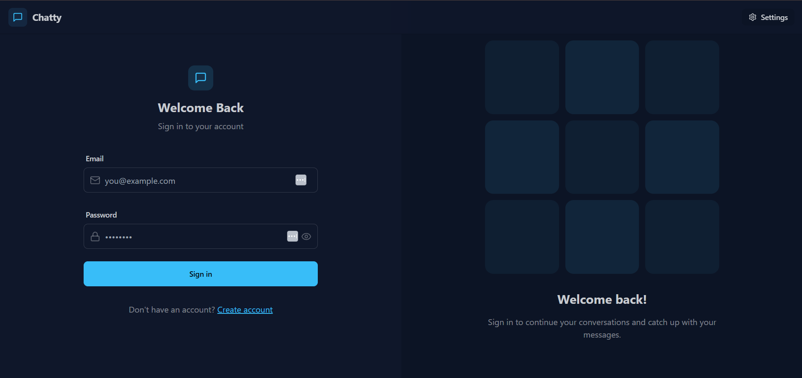

# 💬 RealTime Fullstack Chat Application

> A modern, real-time chat application built with React, Node.js, Socket.io, and MongoDB. Features instant messaging, user authentication, online status indicators, image sharing, and multiple theme options.

## 🌐 Live Demo



* **Frontend (Vercel)**: https://realtime-fullstack-chat-app.vercel.app
* **Backend (Render)**: https://realtime-fullstack-chat-app-backend.onrender.com

> **Note**: Backend may take 30–60 seconds to wake up due to free hosting.

---

## 🎯 About The Project

A full-stack real-time chat application that enables instant communication with secure authentication, real-time messaging, and a responsive, modern UI.

---

## ✨ Features

* JWT-based authentication with secure password hashing
* Real-time messaging using Socket.io
* Image sharing via Cloudinary
* Online/offline user status
* Message history with unread indicators
* Responsive design with multiple themes

---

## 🚀 Tech Stack

* **Frontend:** React, Vite, TailwindCSS, DaisyUI, Zustand
* **Backend:** Node.js, Express.js, MongoDB, Socket.io
* **Other Tools:** Cloudinary, Axios, JWT

---

## 🏁 Getting Started

1. Clone the repository and install dependencies
2. Set up environment variables in `/backend/.env`
3. Run the app:

```bash
npm run dev
```

---

## 🚀 Deployment

The frontend is deployed on Vercel and the backend on Render, with MongoDB Atlas used as the cloud database. The project supports automatic deployments via GitHub integration. Since the backend runs on Render’s free tier, it may go inactive after some time and require a short delay to restart on the next request.

---

## 🙏 Acknowledgments

* https://socket.io/docs/
* https://docs.mongodb.com/
* https://react.dev/
* https://tailwindcss.com/
* https://daisyui.com/
* https://cloudinary.com/

---

<div align="center">

**⭐ Star this repository if you found it helpful!**

Made with ❤️ by Samama

</div>
