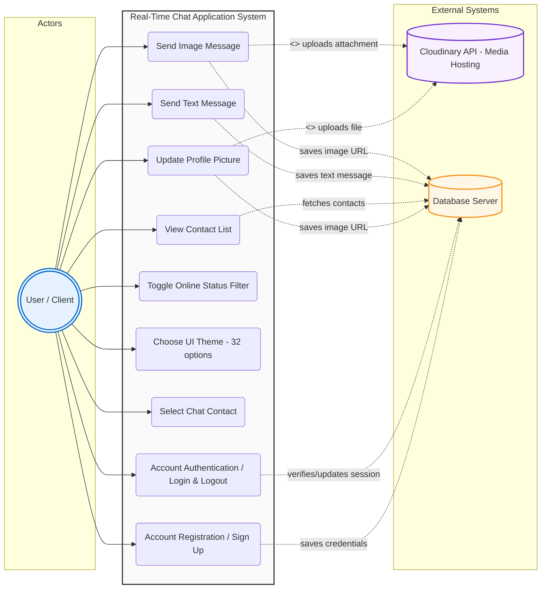
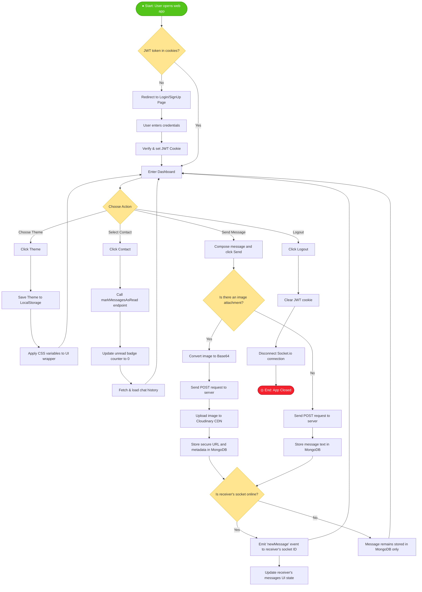
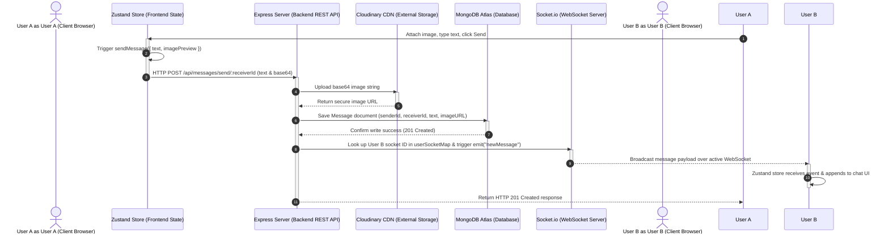
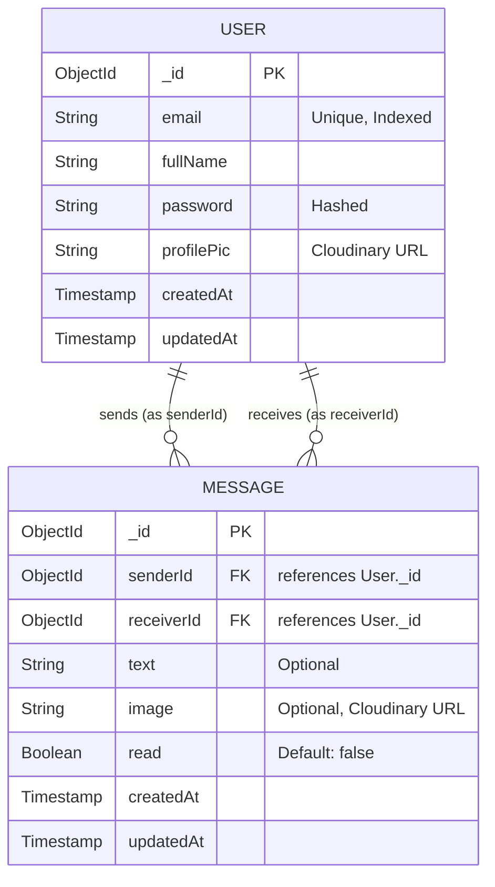
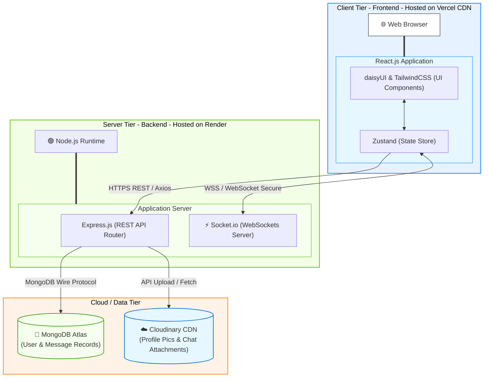

# Real-Time Chat Application Project Diagrams

This document contains standard, clean, and professional UML and architecture diagrams for your MERN + Socket.io Real-Time Chat Application. You can copy the **Mermaid.js** code blocks below and paste them into [mermaid.live](https://mermaid.live) to download them as PNG, SVG, or copy them to your clipboard to insert in Microsoft Word.

---

## 1. Use Case Diagram

---

## 2. Activity Diagram

---

## 3. Sequence Diagram

---

## 4. Database Design (ERD)

---

## 5. System Architecture Diagram

